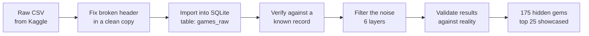

# Steam Hidden Gems — SQL Analysis

A SQL analysis of the Steam game catalog to surface **"hidden gems"**: highly
rated games that haven't reached a mainstream audience. Built with SQLite and
DB Browser for SQLite.

## 🎮 The Hidden Gems

Out of **~125,000 games**, exactly **175** clear every bar of the hidden-gem
definition: *2,000+ reviews, 95%+ positive, priced ≤ $20, and a low ownership
tier (under ~200k owners).* These are games a devoted audience loves that most
people have never heard of.

### Top 25 hidden gems

| # | Game | % Positive | Reviews | Price | Est. Owners |
|--:|------|-----------:|--------:|------:|-------------|
| 1 | A Castle Full of Cats | 99.4% | 3,986 | $2.39 | 100k–200k |
| 2 | Aventura Copilului Albastru și Urât | 99.3% | 2,452 | $1.33 | 50k–100k |
| 3 | The Upturned | 99.3% | 2,347 | $5.99 | 50k–100k |
| 4 | Patrick's Parabox | 99.2% | 4,437 | $9.99 | 100k–200k |
| 5 | Smushi Come Home | 99.1% | 2,191 | $9.99 | 50k–100k |
| 6 | Lil Gator Game | 99.0% | 4,691 | $9.99 | 50k–100k |
| 7 | Buy a Croquette! | 99.0% | 4,355 | **Free** | 100k–200k |
| 8 | A Building Full of Cats | 99.0% | 3,969 | $0.99 | 50k–100k |
| 9 | Look Outside | 99.0% | 2,615 | $6.99 | 50k–100k |
| 10 | Threefold Recital | 98.9% | 3,436 | $11.99 | 50k–100k |
| 11 | planetarian HD | 98.9% | 2,947 | $3.99 | 20k–50k |
| 12 | 星空列车与白的旅行 (Starlight Train) | 98.8% | 5,265 | $5.99 | 20k–50k |
| 13 | Word Game: Episode 0 | 98.8% | 4,482 | **Free** | 100k–200k |
| 14 | Picayune Dreams | 98.8% | 3,179 | $2.99 | 100k–200k |
| 15 | OneShot: World Machine Edition | 98.8% | 2,773 | $7.99 | 50k–100k |
| 16 | Papa's Pizzeria Deluxe | 98.8% | 2,659 | $4.79 | 50k–100k |
| 17 | Summer Pockets | 98.7% | 4,279 | $17.99 | 50k–100k |
| 18 | The Supper | 98.6% | 4,064 | **Free** | 100k–200k |
| 19 | Felvidek | 98.6% | 3,982 | $7.36 | 100k–200k |
| 20 | White Knuckle | 98.6% | 2,992 | $12.59 | 100k–200k |
| 21 | Your Turn To Die -Death Game By Majority- | 98.6% | 2,550 | $13.59 | 100k–200k |
| 22 | Touhou Tenkuushou ~ Hidden Star in Four Seasons | 98.5% | 4,428 | $14.99 | 50k–100k |
| 23 | I Am Your Beast | 98.5% | 3,604 | $13.99 | 100k–200k |
| 24 | Milo and the Magpies | 98.5% | 3,086 | $1.67 | 100k–200k |
| 25 | Epiphyllum in Love | 98.5% | 2,213 | $2.35 | 50k–100k |

### Top 10 *free* hidden gems

| # | Game | % Positive | Reviews | Est. Owners |
|--:|------|-----------:|--------:|-------------|
| 1 | Buy a Croquette! | 99.0% | 4,355 | 100k–200k |
| 2 | Word Game: Episode 0 | 98.8% | 4,482 | 100k–200k |
| 3 | The Supper | 98.6% | 4,064 | 100k–200k |
| 4 | Cureocity | 98.3% | 2,630 | 100k–200k |
| 5 | Katawa Shoujo | 98.2% | 3,736 | 100k–200k |
| 6 | Ticy Adventure Club | 98.1% | 3,000 | 100k–200k |
| 7 | Swallow the Sea | 97.5% | 2,243 | 100k–200k |
| 8 | I commissioned some bees 0 | 97.0% | 4,277 | 50k–100k |
| 9 | The Good Time Garden | 95.9% | 2,606 | 100k–200k |
| 10 | one night, hot springs | 95.5% | 2,774 | 100k–200k |

**What the list reveals:** hidden gems skew heavily toward **cozy, short, and
narrative indie games** — cat puzzlers, visual novels, and low-price experiences
— rather than big-budget genres. They win on *craft and charm*, not marketing
budget, which is exactly why they stay under the radar.

*Rankings are by % positive, tie-broken by review count. The non-English titles
(#2 Romanian, #12 Chinese) are a direct result of the [language-agnostic
scope](#scope--assumptions). Two data artifacts — Portal 2 and Batman: Arkham
City — surfaced through the filters but were excluded as stale/corrupted store
entries; see [Validation](#validation).*

---

> ### Why this project is worth a read
> This is a good example of **real-world data and how to troubleshoot it.** Public
> datasets are rarely clean — this one ships from Kaggle with a broken header that
> silently loads every value into the wrong column. The interesting part of the
> project isn't the final query; it's the process: *noticing* a result that
> couldn't be real, *diagnosing* the cause, *fixing* it without damaging the raw
> data, and *validating* the output against reality before trusting it. That
> troubleshooting loop is most of the actual job of a data analyst, and it's
> documented here step by step so you can follow the reasoning, not just the code.

### The analysis pipeline at a glance



## Data Source

**Steam Games Dataset** by FronkonGames (Kaggle, free):
https://www.kaggle.com/datasets/fronkongames/steam-games-dataset

The dataset contains ~125,000 games with review counts, pricing, ownership
estimates, playtime, genres, and tags.

> **Note:** the full dataset (~380 MB CSV / ~480 MB database) is **not** stored
> in this repo — it exceeds GitHub's 100 MB file limit. A 500-row sample
> (`handoff_bundle/steam_sample.csv`) is included so you can see the data
> shape, and the steps below let you rebuild the full database from the source.

## Data Cleaning Note: Malformed Header in Source File

While exploring the data I noticed `MAX(Positive)` returned a suspiciously flat
**100** across all 125,000+ games — implausible for Steam review counts.

**Diagnosis:** I validated a single known record (AppID 496350, *Supipara*)
against the raw file. The database showed `Positive = 0, Negative = 252`, but
the source row was actually `Positive = 252, Negative = 3`. Every column after
`Price` was shifted by one.

**Root cause:** the source CSV's **header row lists 39 columns while every data
row contains 40**. A missing comma fuses two columns — `Discount` and
`DLC count` — into a single `DiscountDLC count`. Because columns align by
**position**, every field after that point loads into the wrong column.

Here's the misalignment, using the *Supipara* row. One missing header name means
each data value lands one slot to the left of where it belongs:

```
                 Price │ Discount │ DLC count │ ... │ Positive │ Negative
                 ──────┼──────────┼───────────┼─────┼──────────┼─────────
 DATA VALUES:    5.24  │    65    │     0     │ ... │   252    │    3      ← what's really in the file
 BROKEN HEADER:  5.24  │      [DiscountDLC count]  │ ... │    0     │   252     ← 2 columns share 1 name → shift →
                              ▲ one name, two values          ▲ "Positive" now reads Negative's value
```

Think of it like buttoning a shirt with one button skipped: everything below the
mistake is off by one, even though each button is fastened.

**Confirmed at the source:** a fresh, untouched download from Kaggle exhibits
the identical defect, so it ships from the source rather than being introduced
during processing.

**Fix:** I corrected the header in a **cleaned copy** (`steam_clean.csv`),
leaving the raw file untouched, then re-imported. Verified against the known
record — Supipara now correctly reads `Positive = 252, Negative = 3`.

**Takeaway:** a result that looked wrong turned out to be a source-data defect,
not a query error. Validating against a trusted reference record caught it
before it could corrupt the analysis.

## Methodology: Filtering Out the Noise

"Hidden gems" only become visible after peeling away several layers of noise,
one filter at a time. Each filter is a deliberate judgment set from the data
(counts and distributions), not a guessed number.

| Layer | Noise | How it's filtered |
|------|-------|-------------------|
| 1 | **Structural** — misaligned columns from the broken header | Fixed at the source before any analysis (see above) |
| 2 | **Small-sample** — 3 reviews at 100% isn't better than 5,000 at 96% | Review floor: `(Positive + Negative) >= 2000` |
| 3 | **Popularity** — raw positive counts just rank the biggest games | Measure quality as a **percentage**, independent of size |
| 4 | **Mainstream** — a cheap, well-loved blockbuster isn't "hidden" | Keep only low ownership tiers (under ~200k owners) |
| 5 | **Missing data** — the `0 - 0` owners tier means "no estimate," not zero | Excluded explicitly |
| 6 | **Stale records** — delisted entries with corrupted values | Documented (see Validation), not silently kept |

Threshold tuning was evidence-driven — counting how many games survived each
combination until the list was a credible, browsable size:
`5,175 → 2,494 → 728 → 429 → 175`.

**Final criteria:** 2,000+ reviews, 95%+ positive rating, price ≤ $20, and a
low ownership tier (under ~200k, excluding `0 - 0`). **175 games qualify**; the
analysis showcases the top 25 by approval rating.

## Scope & Assumptions

Every filter left *out* is also a decision. This analysis is **language-agnostic**
— it does **not** filter on `Supported languages`, so the results include titles
that may be Chinese- or Japanese-only. As written, the list answers *"the
best-reviewed cheap, low-ownership games on Steam **globally**"* — not *"...that
a specific audience can play."* An English-only filter
(`AND "Supported languages" LIKE '%English%'`) is included, commented out, in the
query file for anyone who needs to scope results to an English-speaking audience.

Stating the audience assumption is deliberate: a "hidden gem" is only a gem to a
player who can actually understand it.

## Validation

Results were checked four ways before being trusted:

1. **Known-record check** — verified the column fix against a game whose true
   values were known (Supipara).
2. **Monotonicity check** — each stricter filter must return *fewer* games; a
   stricter test once returning *more* rows exposed a mis-run query.
3. **Count-before-trust** — checked how many games each filter returned before
   reading any names.
4. **Reality check** — compared final titles against real-world knowledge. This
   caught data artifacts the numbers alone would not:
   - *Batman: Arkham City* listed as **free** (Price = 0) with only ~2,075
     reviews — a stale/delisted entry, not a real free game.
   - *Portal 2* in the `0 - 20000` owners tier with **153,381 reviews** — more
     reviews than the owner ceiling allows, i.e. a corrupted record.
   - *GTA V Legacy* priced at 0 for the same reason.

**Takeaway:** `Price = 0` does not always mean free, and an ownership tier can be
wrong. A record can be internally valid yet contradict reality — human validation
is the last essential filter, and documenting what you find is what makes the
analysis trustworthy.

## The Queries Are Written to Teach

The analysis lives in **[`queries/hidden_gems.sql`](queries/hidden_gems.sql)** —
you can read it right here on GitHub (it renders in the browser; no download
needed) or open it in DB Browser to run it yourself. It's deliberately written
as a **learning resource**, not just working code:

- **A `WHY` header on every step** — explains the *reason* for the question
  before the SQL, so you follow the thinking, not just the syntax.
- **Line-by-line "read out loud" comments** — each query is narrated in plain
  English (`--SELECT the Name column`, `--WHERE at least 2,000 reviews`), so a
  beginner can map each line to what it does.
- **Each function explained on its first few uses, then phased out** — `CAST`,
  `ROUND`, `COUNT`, `GROUP BY`, `IN`, etc. are spelled out the first times they
  appear (repetition to reinforce), then used plainly once they're familiar.
- **A glossary block at the top** — every function/keyword defined in one place
  for quick reference.
- **The full reasoning inline** — the data-cleaning story, the noise-filtering
  logic, the threshold tuning, and the validation notes all live in the file as
  comments, so the code and its rationale travel together.

If you're learning SQL, reading the file top to bottom walks you through a real
analysis the way it actually unfolds: verify the data, explore it, measure
quality, filter noise, tune thresholds, and validate the result.

## How to Build the Database (step by step)

New to databases? This section assumes **zero prior setup**. By the end you'll
have a working SQLite database you can run the queries against.

### What you're building, in plain terms

- **SQLite** is a database that lives in a single file on your computer — no
  server, no install, no account. The whole database is one `.db` file.
- **DB Browser for SQLite** is a free app that lets you *see* that file like a
  spreadsheet and run SQL against it. Think of SQLite as the engine and DB
  Browser as the dashboard.
- A **CSV** is just a text file where commas separate columns. We load the CSV
  *into* SQLite so we can query it with SQL instead of scrolling a giant file.

### Step 0 — Install DB Browser for SQLite (one time)

1. Go to **https://sqlitebrowser.org/dl/**
2. Download the build for your OS (Windows/macOS) and install it like any app.
3. That's it — SQLite itself is bundled in, nothing else to install.

### Step 1 — Download the data

Download `games.csv` from the Kaggle dataset:
**https://www.kaggle.com/datasets/fronkongames/steam-games-dataset**
(A free Kaggle account is required to download. The file is ~380 MB.)

> ⚠️ **Do not open the CSV in Excel to "check" it first.** Excel can silently
> reformat dates, drop leading zeros, and re-save the file in a way that changes
> its structure. Leave the raw file untouched — we inspect it with tools that
> only *read*, never *edit*.

### Step 2 — Fix the broken header (in a COPY)

The raw file has the header defect described above. **Never edit the raw file in
place** — make a corrected copy so the original stays reproducible:

1. Make a duplicate of `games.csv` and name it `steam_clean.csv`.
2. Open **only the first line** of `steam_clean.csv` and find `DiscountDLC count`.
3. Change it to `Discount,DLC count` (add the missing comma).
4. Save. The header now has 40 names to match the 40 columns of data.

<details>
<summary>Prefer to do it without opening the file? (optional one-liner)</summary>

```bash
# Reads the raw file, fixes only the header, writes a clean copy. Data untouched.
sed '1s/DiscountDLC count/Discount,DLC count/' games.csv > steam_clean.csv
```
</details>

### Step 3 — Create the database

1. Open **DB Browser for SQLite**.
2. Click **New Database** and save it as `steam_games.db`.
3. When it pops up a "define table" dialog, click **Cancel** — we'll load the
   table from the CSV instead (easier and more reliable for a big file).

### Step 4 — Import the CSV

1. Menu: **File → Import → Table from CSV file…**
2. Select your `steam_clean.csv`.
3. In the import dialog:
   - **Table name:** `games_raw`
   - ✅ Check **"Column names in first line"**
   - Leave field/quote settings at their defaults (comma-separated, `"` quotes).
4. Click **OK**. DB Browser reads the whole file and builds the table — this
   works no matter how many rows the file has.

### Step 5 — Save

Click **Write Changes** in the top toolbar. (DB Browser does **not** auto-save;
nothing is written to the `.db` file until you do this.)

### Step 6 — Verify before you trust it ✅

Go to the **Execute SQL** tab, paste this, and hit ▶ Run:

```sql
SELECT AppID, Name, Positive, Negative, Price
FROM games_raw
WHERE AppID = 496350;
-- Expected: Positive = 252, Negative = 3, Price = 5.24
```

If you see **Positive = 252, Negative = 3, Price = 5.24**, the header fix worked
and every column is aligned. If `Positive` shows `0` and `Negative` shows `252`,
the header wasn't fixed — go back to Step 2.

You're now ready to run the analysis in [`queries/hidden_gems.sql`](queries/hidden_gems.sql).

### Troubleshooting

| Symptom | Likely cause | Fix |
|--------|--------------|-----|
| `no such table: games_raw` | Import didn't run, or table named differently | Re-do Step 4; confirm the table name is exactly `games_raw` |
| Verify query shows `Positive = 0` | Header not fixed | Redo Step 2 (the missing comma) and re-import |
| `MAX(Positive)` is a flat, tiny number | Columns misaligned | Same as above — the header fix didn't take |
| Numbers won't sort/compare correctly | Column imported as text | In the CSV import dialog, set numeric columns to Integer/Real, or wrap them in `CAST(col AS INTEGER)` in your query |
| Changes disappear after closing | Forgot to save | Click **Write Changes** (Step 5) |

## Files

| File | Description |
|------|-------------|
| `queries/*.sql` | Analysis queries |
| `handoff_bundle/steam_sample.csv` | 500-row sample of the cleaned data |
| `README.md` | This file |

Full data files and `steam_games.db` are excluded via `.gitignore` — rebuild
them locally using the steps above.

## Roadmap: Visualizing These Findings

This repo is the **methodology home base** — the cleaning, the SQL, and the
validation. The same findings are being rendered in the tools analysts are
actually hired to use, each highlighting a different question:

- [x] **[Browsable list + live player voting](https://michaelnocito.github.io/steam-hidden-gems-list/)** —
  a public front-end for the 175 gems (cover art, ratings, Steam links) where
  visitors vote on whether each pick really is a hidden gem, turning the
  analysis into a "predicted vs. real players" feedback loop.
  ([repo](https://github.com/michaelnocito/steam-hidden-gems-list))
- [ ] **Excel + SQL** — export the results to a workbook: a ranked hidden-gems
  table plus a pivot/chart view. The most common real-world SQL → spreadsheet
  handoff, and the most accessible way to explore the list. *(next)*
- [ ] **Tableau Public** — an interactive dashboard: filter gems by genre,
  price, and ownership, with a live public link anyone can open.
- [ ] **Power BI** — a price-vs-rating / value-per-hour view, covering the other
  major BI tool.

Each version links back here for the "how it was built" story. *(Links added as
each is published.)*

---

## About

Built by **Michael Nocito**, data analyst. This project is part of a broader set
of analyst learning tools and portfolio work:

- 🧰 **[Analyst Prep Kit](https://michaelnocito.github.io/analyst-prep-kit/)** — hands-on
  Excel, SQL, Python, Power BI, and Tableau practice kits.
- 🌐 **[michaelnocito.github.io](https://michaelnocito.github.io)** — portfolio & more projects.

*If you know a hidden gem that belongs on this list — or spot one that shouldn't —
open an issue. Feedback welcome.*
