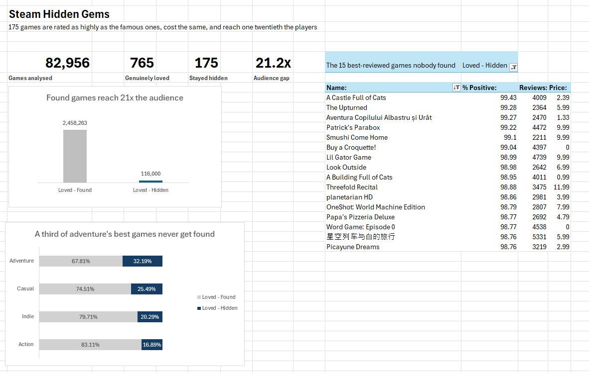

# Steam Hidden Gems: an Excel dashboard

**Author:** Michael Nocito
**Tools:** Excel (PivotTables, PivotCharts, COUNTIF and AVERAGEIF)
**Data:** 82,956 Steam games

175 games on Steam are rated as highly as the famous ones. They cost the same.
They reach one twenty-first of the players.

This dashboard finds them and shows why the usual explanations do not hold.

---

## The four numbers

| | |
|---|---|
| Games analysed | 82,956 |
| Genuinely loved | 765 |
| Stayed hidden | 175 |
| Audience gap | 21.2x |

"Genuinely loved" means 2,000 or more reviews and 95% or better positive. The
review count matters. A game with nine reviews and a perfect score tells you
nothing.

Of those 765 loved games, 175 never found an audience. That is 22.9%. Roughly
one in four games that people love stays unknown.

---

## The question

A list of good cheap games is not analysis. Anyone can sort a spreadsheet.

The question worth asking is why some loved games get found and others do not.
There are two possible answers.

The first: hidden games are worse. Cheaper, shorter, lower rated. If that is
true, staying unknown makes sense and there is nothing to explain.

The second: they are the same. If that is true, quality does not explain
anything, and being found is mostly luck.

Four numbers decide it.

---

## What I found

| | Price | Rating | Hours played | Audience |
|---|---|---|---|---|
| Loved and found | $7.67 | 96.6% | 10.8 | 2,458,263 |
| Loved and hidden | $7.11 | 97.0% | 7.9 | 116,000 |

The hidden games cost 56 cents less. They are rated slightly higher. They run
about three quarters as long.

Then the audience column falls off a cliff.

**Same product, one twenty-first of the players.** That is the finding.

---

## The obvious objection

The first thing anyone says to this is that hidden games must be niche genres.

So I checked. Each genre is measured against its own loved games, not against
the other genres.

| Genre | Share that stayed hidden |
|---|---|
| Adventure | 32.2% |
| Casual | 25.5% |
| Indie | 20.3% |
| Action | 16.9% |

Genre matters some. Adventure games hide almost twice the share that action
games do.

It does not explain the finding away. Every genre hides a large chunk of its
own best work. The lowest is action at 16.9%, and that is still one in six.

Eight other genres exist in this data. Each has between 1 and 18 loved games.
I left them out. Below about 20 games a percentage is noise, and I would rather
show four numbers I trust than twelve I do not.

---

## What I threw away

I also cut the data by price band. Games over $20 showed a 0% hidden rate. A
clean result, and a chartable one.

It is worthless.

"Hidden gem" is defined in this data as costing $20 or less. A game over $20
cannot be one. The chart would have been my own filter reflected back at me,
dressed up as a discovery.

The tell was how clean it was. Real findings are messy. 32% against 17% is
messy. 0% against 21% is too tidy to be true, and tidiness is the warning.

So there is no price chart on this dashboard. The check that produced nothing
was still worth running.

---

## What I checked before publishing

**The averages are pulled up by a few huge hits.** Average audience for found
games is 2.46 million, but the middle game sits at 750,000. On middle values
the gap is 5x rather than 21x. Both are real. The 21x is the average gap, and
the 5x is the typical gap. I lead with the average and I say this here so
nobody has to catch me at it.

**The segment counts were checked against the source before anything was
built.** 175 hidden, 590 found, 82,191 outside the loved group. They add to
82,956.

**One column was corrupt and I nearly shipped it.** Excel opened the file
assuming the wrong alphabet, so 4,685 of the 82,956 game names came in as
symbols. Nothing errored. Two of them reached my top 15 list before I noticed.
The names were re-exported with the correct setting and pasted back over the
old column.

---

## How it is built

Everything reads from one Excel Table named `Games`, so the numbers update if
the data does.

One added column tags every row as found, hidden, or outside the loved group.
Every chart and count works off that tag.

The four headline numbers are formulas, not typed. The audience gap is one
line: average audience of found games divided by average audience of hidden
ones.

Four PivotTables feed the page. Each chart has its own, so filtering one
cannot silently change another.

---

## Files

| File | What it is |
|---|---|
| `steam_hidden_gems_dashboard.xlsx` | The dashboard |
| `steam_hidden_gems.csv` | The source data, 82,956 rows |
| `BUILD_GUIDE_SIMPLE.md` | Build it yourself, step by step |

The SQL that produced this data is in [`../queries/`](../queries/), and the
full analysis is in the [main README](../README.md).

---

## Build it yourself

`BUILD_GUIDE_SIMPLE.md` walks the whole thing from the raw file to the finished
page. It assumes you have opened Excel before and nothing else.

Download the data, follow it, and change one threshold at the end. Move the 95%
bar to 98% and see which games drop out. Then decide whether you would have
dropped them.
